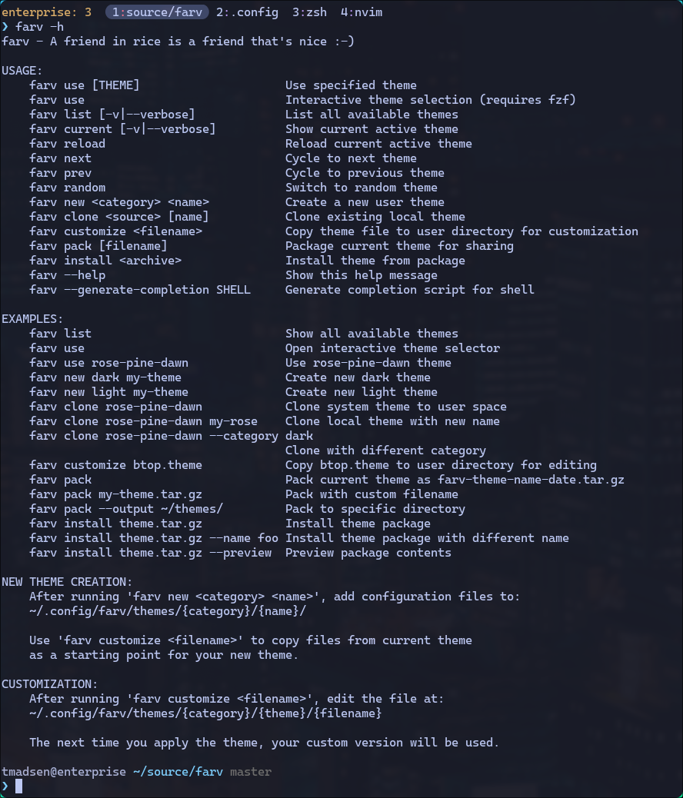

# farv

**A friend in rice is a friend that's nice**

farv is a layered theme management system that helps building and switching
between complete desktop themes using a powerful hierarchy concept.

The word "farv" is Danish and means "color" as in an imperative verb - aka. a command.

## Table of Contents

- [The Layer Concept](#the-layer-concept)
- [Quick Start](#quick-start)
- [Application Setup](#application-setup)
- [Advanced Features](#advanced-features)
- [Installation](#installation)
- [Contributing](#contributing)

## The Layer Concept

Think of farv themes like transparent sheets stacked on top of each other.
When you look down through the stack, you see the top-most visible element
at each position. This is exactly how farv resolves your theme files.

### How Layers Work

When you apply a theme like `tokyonight-night`, farv searches through
multiple layers in priority order to find each configuration file:

```
Priority  Layer                           Example Path
   1      User theme-specific             ~/.config/farv/themes/dark/tokyonight-night/
   2      System theme-specific           /usr/share/farv/themes/dark/tokyonight-night/
   3      User category-level             ~/.config/farv/themes/dark/
   4      System category-level           /usr/share/farv/themes/dark/
   5      User global                     ~/.config/farv/themes/
   6      System global                   /usr/share/farv/themes/
```

For each file (like `alacritty.toml`), farv takes the first one it finds,
creating a symbolic link from `~/.config/farv/current/alacritty.toml` to
that file.

### Why This Matters

**Override specific files**: Want to use `tokyonight-night` but with your
own backgrounds? Just add background images to
`~/.config/farv/themes/dark/tokyonight-night/backgrounds/` and farv will
make them available alongside the system theme's backgrounds.

**Share common settings**: Put files that work across multiple themes
in category-level directories. All your dark themes can share the same
`gtk.sh` script, while light themes use a different one.

**Personal defaults**: Files in your global user directory (`~/.config/farv/themes/`)
act as fallbacks for any theme that doesn't specify them.

### A Practical Example

Let's say you want to customize the popular `rose-pine-dawn` theme:

```
# System provides the base theme
/usr/share/farv/themes/light/rose-pine-dawn/
├── alacritty.toml
├── waybar.css
├── hyprland.conf
└── backgrounds/
    ├── wallpaper1.png
    └── wallpaper2.png

# You add personal touches
~/.config/farv/themes/light/rose-pine-dawn/
├── backgrounds/
│   └── my-custom.png      # Your custom background
└── tmux.conf              # Your tmux config

# You share settings across all light themes
~/.config/farv/themes/light/
└── gtk.sh                 # Light GTK theme script
```

When you run `farv use rose-pine-dawn`, you get:

- All backgrounds from both system and user directories (layers 1 & 2)
- Your tmux config (layer 1)
- System's alacritty, waybar, hyprland configs (layer 2)
- Your light GTK script (layer 3)

## Quick Start

### List available themes

```bash
farv list
```

### Use a theme

```bash
farv use <tab> # tab completion shows available themes
farv use rose-pine-dawn
```

### Interactive selection (requires fzf)

```bash
farv use
```

### Show current theme

```bash
farv current
```

### Cycle through themes

```bash
farv next      # Next theme alphabetically
farv prev      # Previous theme
farv random    # Random theme
```

## Application Setup

Farv uses three integration methods to connect your applications with themes. The philosophy is simple: **your personal configuration stays in your config files, theme settings come from farv**.

### Directory Structure

```
~/.config/farv/
├── current/              # Symlinks to active theme files (managed by farv)
│   ├── alacritty.toml -> /usr/share/farv/themes/dark/tokyonight-night/alacritty.toml
│   ├── neovim.lua -> /usr/share/farv/themes/dark/tokyonight-night/neovim.lua
│   ├── tmux.conf -> /usr/share/farv/themes/dark/tokyonight-night/tmux.conf
│   ├── yazi-theme.toml -> /usr/share/farv/themes/dark/tokyonight-night/yazi-theme.toml
│   └── ... (other theme files)
└── config                # Farv configuration

/usr/share/farv/themes/   # Theme files (or ~/source/farv/themes during development)
├── dark/
│   ├── gruvbox-dark/
│   ├── tokyonight-night/
│   └── ...
└── light/
    ├── gruvbox-light/
    └── ...
```

### Integration Methods

#### Method 1: Import/Source (Recommended)

Your config file imports or sources the farv-managed theme file. This keeps your settings separate from theme settings.

##### Alacritty

Add to `~/.config/alacritty/alacritty.toml`:

```toml
[env]
TERM = "xterm-256color"

[window]
padding.x = 14
padding.y = 14
opacity = 0.98

[font]
normal = { family = "CaskaydiaMono Nerd Font", style = "Regular" }
size = 11

# Import farv theme (colors only)
[general]
import = ["~/.config/farv/current/alacritty.toml"]
```

##### Tmux

Add to `~/.tmux.conf`:

```bash
# Your settings
set -g default-terminal "tmux-256color"
set -g mouse on
set -g base-index 1

# Load theme colors from farv
source-file ~/.config/farv/current/tmux.conf

# Nerdfont characters
HALF_ROUND_OPEN="#(printf '\uE0B6')"
HALF_ROUND_CLOSE="#(printf '\uE0B4')"

# Apply theme colors to tmux status bar
# Basic colors of the Statusbar. "default" = transparent.
set-option -g status-style bg=default,fg=${TEXT_MAIN}

# Style and set contents on the left section
set-option -g status-left "#[bg=default,fg=${SESSION_HIGHLIGHT}]#h: #S  "

set-option -g status-right ""

# Style and set content for the inactive windows
set-option -g window-status-format "\
 \
#I\
#[fg=${WINDOW_INACTIVE_SEP}]:\
#[fg=default]#W\
 \
"

# Style and set content for the active windows
set-option -g window-status-current-format "\
#[fg=${WINDOW_ACTIVE_BG},bg=default]${HALF_ROUND_OPEN}\
#[bg=${WINDOW_ACTIVE_BG},fg=default]#I\
#[fg=${WINDOW_ACTIVE_SEP}]:\
#[fg=default]#W\
#[fg=${WINDOW_ACTIVE_BG},bg=default]${HALF_ROUND_CLOSE}\
"

# Remove the separator between window list items, as we already have spacing
# "around" inactive items
set-option -g window-status-separator ""
```

The farv theme file provides these color variables that you can customize in your status bar:
- `SESSION_HIGHLIGHT` - Hostname and session name color
- `WINDOW_ACTIVE_BG` - Background for active window
- `WINDOW_ACTIVE_SEP` - Separator color for active window
- `WINDOW_INACTIVE_SEP` - Separator color for inactive windows
- `TEXT_MAIN` - Main text color

##### Waybar

Add to `~/.config/waybar/style.css`:

```css
@import "../../.config/farv/current/waybar.css";

* {
  border: none;
  font-family: CaskaydiaMono Nerd Font Propo;
  font-size: 16px;
  background-color: @base;
  color: @text;
}

/* Your custom styling here */
```

##### Hyprland

Add near the end of `~/.config/hypr/hyprland.conf`:

```bash
# Your keybindings, rules, animations, etc.
bind = SUPER, Return, exec, alacritty
bind = SUPER, Q, killactive

# Use farv theme for wofi launcher
bind = SUPER, space, exec, pkill wofi || wofi --show drun --style="$HOME/.config/farv/current/wofi-search.css"

# THEME OVERRIDES (farv)
# The farv theme system may override colors defined above
source = ~/.config/farv/current/hyprland.conf
```

##### Neovim

With lazy.nvim - Create symlink in plugins directory:

```bash
cd ~/dotfiles/nvim/lua/plugins/  # or ~/.config/nvim/lua/plugins/
ln -sf ~/.config/farv/current/neovim.lua farv-theme.lua
```

The farv `neovim.lua` file is a complete lazy.nvim plugin specification that returns the theme configuration:

```lua
-- Example: themes/dark/tokyonight-night/neovim.lua
return {
    "folke/tokyonight.nvim",
    opts = {
        style = "night",
        dim_inactive = true,
    },
    config = function()
        vim.cmd("set background=dark")
        vim.cmd("colorscheme tokyonight-night")
    end,
}
```

##### Yazi

Create symlink for theme file:

```bash
ln -sf ~/.config/farv/current/yazi-theme.toml ~/.config/yazi/theme.toml
```

Your `~/.config/yazi/yazi.toml` stays separate with your preferences:

```toml
# Your Yazi configuration
[manager]
show_hidden = false

[preview]
max_width = 8096
max_height = 8096
```

#### Method 2: Script-Modified Configuration

For applications where you want farv to update just the theme setting while preserving all your other configuration.

##### Bat

Automatic configuration management:

Your `~/.config/bat/config`:

```bash
# Your settings - farv won't touch these
--style="numbers,changes,header"
--paging=auto

# This line is automatically managed by farv
--theme="gruvbox-dark"
```

When you switch themes, farv's `bat.sh` script automatically updates only the `--theme=` line. Your other settings remain unchanged.

#### Method 3: Executable Scripts

Scripts that run commands to apply themes to running applications or system settings.

##### GTK

Themes are applied via `gtk.sh` script:

```bash
# themes/dark/gtk.sh
gsettings set org.gnome.desktop.interface color-scheme 'prefer-dark'
gsettings set org.gnome.desktop.interface gtk-theme 'Adwaita-dark'
```

##### Claude Code

Theme applied via `claude-code.sh`:

```bash
# themes/dark/claude-code.sh
if command -v claude &>/dev/null; then
  claude config set -g theme dark
fi
```

### How Theme Switching Works

When you run `farv use tokyonight-night`:

1. **Symlinks Updated**: farv updates all symlinks in `~/.config/farv/current/` to point to the new theme's files
2. **Scripts Execute**: Any executable `.sh` scripts in the theme directory are executed (must have execute permission: `chmod +x script.sh`)
3. **Applications Reload**: Applications that import/source farv files pick up changes on next launch or manual reload

### Supported Applications

| Application | Method | Farv Manages | You Manage |
|------------|--------|--------------|------------|
| Alacritty | Import | Colors | Font, padding, keybindings |
| Tmux | Source | Color variables | Status bar, keybindings, plugins, behavior |
| Neovim | Symlink | Colorscheme plugin | All other plugins, settings |
| Yazi | Symlink | Theme/colors | File manager settings |
| Waybar | Import | Color variables | Layout, sizing, components |
| Hyprland | Source | Color overrides | Rules, keybindings, animations |
| Bat | Script | Theme name | Style, paging, other options |
| Wofi | Command arg | Styles | Menu behavior |
| GTK | Script | System theme | - |
| Claude Code | Script | Theme setting | - |

## Advanced Features

### Theme Management

```bash
farv new light my-theme        # Create new theme
farv clone rose-pine-dawn      # Clone existing theme
farv pack my-theme.tar.gz      # Package theme for sharing
farv install theme.tar.gz      # Install theme package
```

### Customize Current Theme

You can customize the current theme one file at a time.

```bash
farv customize <tab>  # Show list of files for current theme
```

```bash
farv customize ghostty  # Copy the ghostty file to your override directory
```

### Reload Theme

```bash
farv reload # Reapply current theme
```

### Wallpapers and Backgrounds

Farv has special support for managing multiple backgrounds per theme. Each theme can have a `backgrounds/` directory containing wallpaper images.

#### How Backgrounds Work

When you switch themes, farv creates symlinks in `~/.config/farv/current/backgrounds/` for all background files from the active theme. It also creates a special `current-background` symlink that points to the selected wallpaper.

```bash
~/.config/farv/current/backgrounds/
├── wallpaper1.png -> /usr/share/farv/themes/dark/tokyonight-night/backgrounds/wallpaper1.png
├── wallpaper2.png -> /usr/share/farv/themes/dark/tokyonight-night/backgrounds/wallpaper2.png
├── my-custom.png -> ~/.config/farv/themes/dark/tokyonight-night/backgrounds/my-custom.png
└── current-background -> wallpaper1.png  # Points to selected background
```

#### Managing Backgrounds

```bash
# List available backgrounds for current theme
farv background list

# Select a specific background
farv background use wallpaper2.png

# Select a random background
farv background random
```

#### Setting Up Wallpaper Display

For swaybg users, add this to your Hyprland config:

```bash
# In ~/.config/hypr/hyprland.conf
exec-once = swaybg -i ~/.config/farv/current/backgrounds/current-background -m fill
exec-once = farv background random
```

The included `swaybg-wallpaper.sh` script will automatically reload swaybg when you switch themes or change backgrounds.

If you use a different wallpaper manager (like `feh`, `nitrogen`, or `hyprpaper`), you can create a custom script in one of your layer folders:

- `~/.config/farv/themes/my-wallpaper.sh` (runs for all themes)
- `~/.config/farv/themes/dark/my-wallpaper.sh` (runs for dark themes)
- `~/.config/farv/themes/light/my-wallpaper.sh` (runs for light themes)

Example script for hyprpaper:

```bash
#!/bin/bash
# ~/.config/farv/themes/my-wallpaper.sh

WALLPAPER="$HOME/.config/farv/current/backgrounds/current-background"

if [ -f "$WALLPAPER" ]; then
  hyprctl hyprpaper preload "$WALLPAPER"
  hyprctl hyprpaper wallpaper ",$WALLPAPER"
fi
```

Remember to make your script executable:

```bash
chmod +x ~/.config/farv/themes/my-wallpaper.sh
```

### Writing Scripts

Scripts can be placed at different layers depending on their scope. For
something like setting the system appearance to either light or dark mode,
it should be in either:

- `~/.config/farv/themes/dark`, or
- `~/.config/farv/themes/light`

Check the `/usr/share/farv/themes/dark/gtk.sh` and
`/usr/share/farv/themes/light/gtk.sh` for inspiration.

You could have some very specific scripts for a theme that you would like to run
as well. Then just put it in the theme folder, like
`~/.config/farv/themes/dark/my-theme/gtk.sh` and it will be run after applying
`my-theme`.

Remember to make your scripts executable for them to run:

```bash
chmod +x ~/.config/farv/themes/dark/my-theme/gtk.sh
```

#### Example: Bat Theme Script

Here's an example of a script that modifies an existing config file:

```bash
#!/bin/bash
# bat.sh - Updates bat theme in user's config

if ! command -v bat &>/dev/null; then
  exit 0
fi

BAT_CONFIG="$HOME/.config/bat/config"
mkdir -p "$(dirname "$BAT_CONFIG")"

if [ ! -f "$BAT_CONFIG" ]; then
  touch "$BAT_CONFIG"
fi

# Update or add theme line
if grep -q "^--theme=" "$BAT_CONFIG"; then
  sed -i 's/^--theme=.*$/--theme="gruvbox-dark"/' "$BAT_CONFIG"
else
  echo '--theme="gruvbox-dark"' >> "$BAT_CONFIG"
fi
```

At the time of writing this, the included scripts to change wallpaper, reload
tmux configuration etc. is pretty sparse and specific to the tools I use at the
moment. If you write scripts that you think can benefit more than just you,
please consider sharing it in an issue and/or pull request.

### Adding New Application Support

To add support for a new application:

1. **Create theme files**: Add config file in each theme directory (e.g., `my-app.conf`)

2. **Choose integration method**:
   - **Preferred**: Import/source method - keeps user config separate
   - **Alternative**: Script-modified - when you need to update specific lines
   - **Last resort**: Executable script - for runtime commands

3. **Test**: Switch themes and verify the application updates correctly

**Best Practice**: Use the import/source method whenever possible. It provides the cleanest separation between user settings and theme settings.

## Installation

```bash
git clone https://github.com/datamadsen/farv.git
cd farv
sudo ./install.sh
```

**Note:** Installation has only been tested on Arch Linux at the time of writing this, so
check what the install script does and adapt it to your system if necessary.
Here are the cliff notes:

- Platform Detection: Detects whether running on Linux or macOS

- Path Configuration: Sets appropriate installation paths
based on platform (Homebrew paths on macOS, system paths on
Linux)

- Binary Installation: Copies the farv binary to system binary
  directory (/usr/bin on Linux, Homebrew prefix on macOS)

- Theme Installation: Creates system directories and copies
light/dark themes to /usr/share/farv/themes/ (or macOS
equivalent)

- Library Installation: Installs utility libraries to system
share directory

- Shell Completion Setup: Generates and installs tab
completion scripts for bash, zsh, and fish shells

- User Configuration: Creates user config directory at
~/.config/farv/ with default config file

- Permission Handling: Uses sudo on Linux, but not on macOS
when using Homebrew paths

- Validation: Checks that required files (bin/farv, themes/)
exist before proceeding

## Contributing

Contributions are welcome! There isn't really any guidelines - just be yourself.
Contribute via PR or even with a tar file produced with `farv pack`.

## Screenshot


